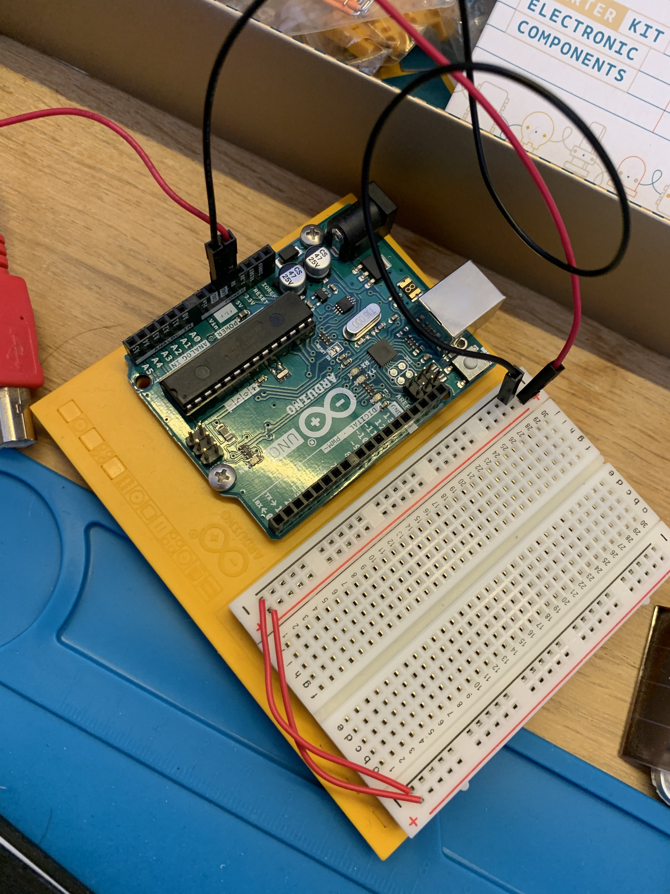
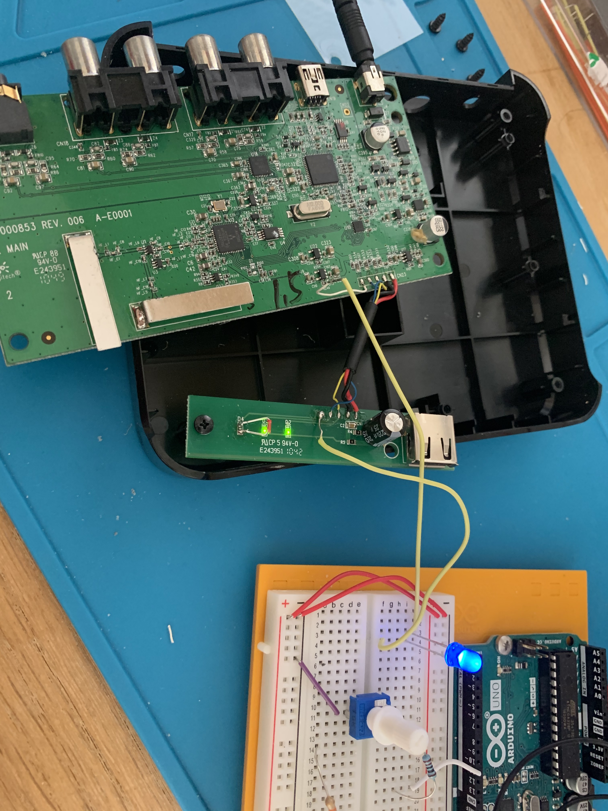

# EKR IDD Lab 01
## A.

## B.
**a. What color stripes are on a 220 Ohm resistor?**

Red - Black - Black - Red - Brown (5-stripe resistor).

**b. What do you have to do to light your LED?**

Press the button on the switch!

See ```1B_manual_blinking.MOV```.

## C.
### 1.
**a. What line(s) of code do you need to change to make the LED blink (like, at all)?**

None

**b. What line(s) of code do you need to change to change the rate of blinking?**

Change how long to delay when writing to a pin.
```c++
delay(20)
```

**c. What circuit element would you want to add to protect the board and external LED?**

A resistor.

**d. At what delay can you no longer perceive the LED blinking? (And how can you prove to yourself that it is, in fact, still blinking?**

A blink frequency of ~10ms seems to be inconceivable as a blink. You can film it with a high frame rate camera to verify that this is the case.

**e. Save your new blink code to your lab 1 repository, with a link on the Lab report wiki page.**

[part_c.ino](https://github.com/elijah-rou/idd-lab-1/blob/master/1c/part_c.ino)

### 2.

See ```1C_led_blinking.MOV```.

```c++
int blinkFrequency = 20;
// the setup function runs once when you press reset or power the board
void setup() {
  // initialize digital pin LED_BUILTIN as an output.
  pinMode(9, OUTPUT);
}

// the loop function runs over and over again forever
void loop() {
  digitalWrite(9, HIGH);   // turn the LED on (HIGH is the voltage level)
  delay(blinkFrequency);                       // wait for a second
  digitalWrite(9, LOW);    // turn the LED off by making the voltage LOW
  delay(blinkFrequency);                       // wait for a second
}
```
## D.
**a. Are you able to get the LED to glow the whole turning range of the potentiometer? Why or why not?** 

Yes, as the potentiometer can only set the resistance very high. It cannot block current.

See ```1D_potentiometer.MOV```.
## E.
**a. What do you have to modify to make the code control the circuit you've built on your breadboard?**

Change the ```led``` variable to ```11```.
```c++
int led = 11;
```

**b. What is analogWrite()? How is that different than digitalWrite()?**

```digitalWrite``` sets the specified output pin to one of two states, ```HIGH``` or ```LOW``` (corresponding to Input Voltage and ground). ```analogWrite``` sets the periodic high/low signal of the output pin. A value from 0-255 is specified, such that 255 corresponds to being on 100% of the time and 0 corresponds to being on 0% of the time. Everything in between is a proportion.

[part_e.ino](https://github.com/elijah-rou/idd-lab-1/blob/master/1c/part_e.ino)

See ```1E_fade_blink_pattern.MOV```.

```c++
int led = 11;           // the PWM pin the LED is attached to
int brightness = 0;    // how bright the LED is
int fadeAmount = 15;    // how many points to fade the LED by
int count = 0;
int countMax = 3;

// the setup routine runs once when you press reset:
void setup() {
  // declare pin 9 to be an output:
  pinMode(led, OUTPUT);
}

// blink with a 500ms interval
void blink(int count, int led){
  for(int i = 0; i<count; i++){
    digitalWrite(led, LOW);
    delay(500);
    digitalWrite(led, HIGH);
    delay(500);
    digitalWrite(led, LOW);
    delay(500);
  }
}
  

// the loop routine runs over and over again forever:
void loop() {
  // set the brightness of pin 9:
  analogWrite(led, brightness);

  // change the brightness for next time through the loop
  brightness += fadeAmount;

  // blink count number of times on a fade
  if (brightness >= 255){
    count++;
    blink(count, led);
    fadeAmount *= -1;
  }
  else if (brightness <= 0){
    delay(500);
    fadeAmount *= -1;
  }

  if (count == countMax){
    count = 0;
  }
  
 delay(20);
}
```
## F
### 1.
This device was the receiver for an old wireless Logitech headset. It operated with a 2.4GHz connection and allowed up to 3 devices to connect to it simultaneously. 

**a. Is there computation in your device? Where is it? What do you think is happening inside the "computer?"**

There are a variety of chips on the PCB. The two that stand out are:

- The Trident UAC 355 chip, USB audio DAC. (The biggest chip)
- The Avnera AV7211, the wireless module. (The 2nd biggest chip)

The Trident module is a DAC, so it converts digital audio signal into analog signals. The Avnera module probably receives these digital signals from the headset.

**b. Are there sensors on your device? How do they work? How is the sensed information conveyed to other portions of the device?**

The only "sensors" would be the antennae for the wireless module (the two metal fins). These fed into the Avnera chip, which translates the 2.4GHz signals.

**c. How is the device powered? Is there any transformation or regulation of the power? How is that done? What voltages are used throughout the system?**

There is an external power brick that plugs directly into the wall, converting AC power supplying a consistent 6V to the system. As the PCB is quite complicated, it is difficult to know what voltages are used throughout.

**d. Is information stored in your device? Where? How?**

As the hub "remembers" devices that connect to it, it must store some property of those devices (probably something like a MAC address). There are no memory modules however, so the likely place it stores such information is in the Avnera chip.

### 2.
There were 3 mini-LEDs on the extension pcb used to indicate which devices were connected. Initially, I thought I could simply connect an LED through the same channel as one of those mini-LEDS. However, it seemed the mini-LEDs weren't supplied with much voltage. When I connected my own in series with one of them, it did not light up and caused the mini-LED to be far dimmer. I decided that in order to get my own LED to work, one of the mini-LEDs needed to be desoldered from the extension pcb and replaced with just a wire.
### 3.
See the video ```1F_LogitechFrakenlight.MOV``` for the results!