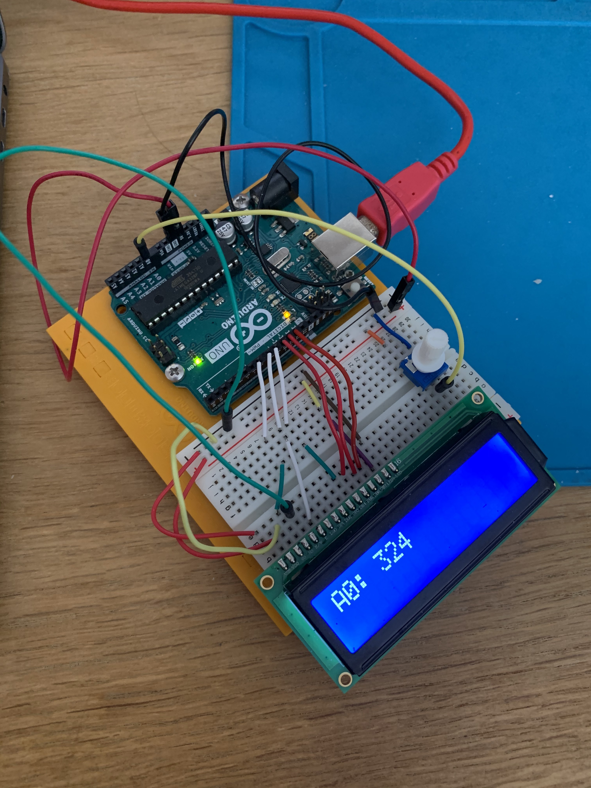
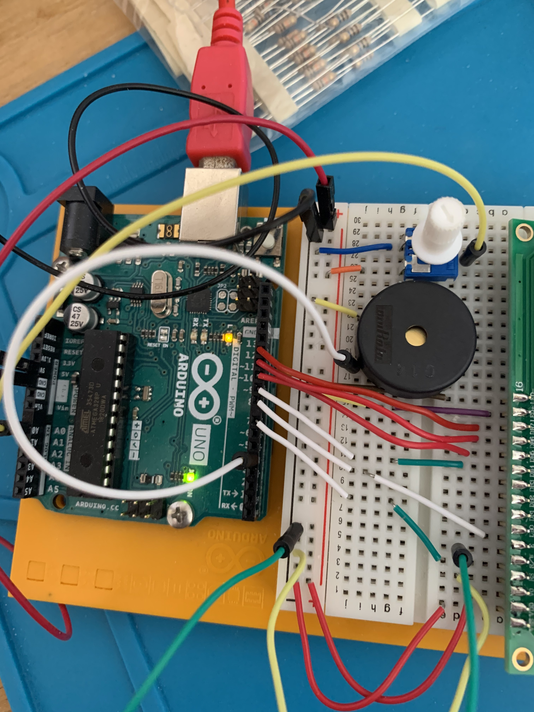

# EKR IDD Lab 02
## Part B. Make a lowly Multimeter
```c++
// https://create.arduino.cc/projecthub/Guitarman1/displaying-sensor-values-on-lcd-c0c44f
// include the library code:
#include <LiquidCrystal.h>

// initialize the library with the numbers of the interface pins
LiquidCrystal lcd(7,8,9,10,11,12);

int potPin = A0; // Analog pin used
int potVal = 0; // Reading on analog pin
int currentVal = 0; // State of analog pin

void setup(){
// set up the LCD's number of columns and rows:
  lcd.begin(16, 2);
  lcd.clear();

  pinMode(potPin, INPUT);
}

void loop(){
  // Control to delay reading of analog input and to only rewrite the screen on a change
  potVal = round(analogRead(potPin));
  if(potVal != currentVal){
    lcd.clear();
    lcd.setCursor(0,0); // Sets the cursor to col 0 and row 0
    lcd.print("A0: "); // Prints Sensor Val: to LCD
    lcd.print(potVal); // Prints value on Potpin to LCD
    currentVal = potVal;
  }
  delay(200);
}
```


## Part D. Make your Arduino sing!
```c++
#include "pitches.h"

int melody[] = {
  NOTE_D3,NOTE_D3,NOTE_D3,NOTE_G3,NOTE_D4,NOTE_C4,NOTE_B3,NOTE_A3,NOTE_G4,NOTE_D4, \
  NOTE_C4,NOTE_B3,NOTE_A3,NOTE_G4,NOTE_D4,NOTE_C4,NOTE_B3,NOTE_C4,NOTE_A3,0};

int noteDurations[] = {
  10,10,10,2,2,10,10,10,2,4, \
  10,10,10,2,4,10,10,10,2,4};

int song_len = sizeof(melody)/sizeof(melody[0]);

void setup() {
  // iterate over the notes of the melody:
  for (int thisNote = 0; thisNote < song_len; thisNote++) {

    // to calculate the note duration, take one second divided by the note type.
    //e.g. quarter note = 1000 / 4, eighth note = 1000/8, etc.
    int noteDuration = 1000 / noteDurations[thisNote];
    tone(4, melody[thisNote], noteDuration);

    // to distinguish the notes, set a minimum time between them.
    // the note's duration + 30% seems to work well:
    int pauseBetweenNotes = noteDuration * 1.30;
    delay(pauseBetweenNotes);
    // stop the tone playing:
    noTone(4);
  }
}

void loop(){
    
}
```


**a. How would you change the code to make the song play twice as fast?**
Alter each element in ```noteDurations``` by 2.

**b. What song is playing?**
Star Wars theme!
## Part E. Make your own timer
**a. Make a short video showing how your timer works, and what happens when time is up!**
See ```Lab2/media/part_e.mov```