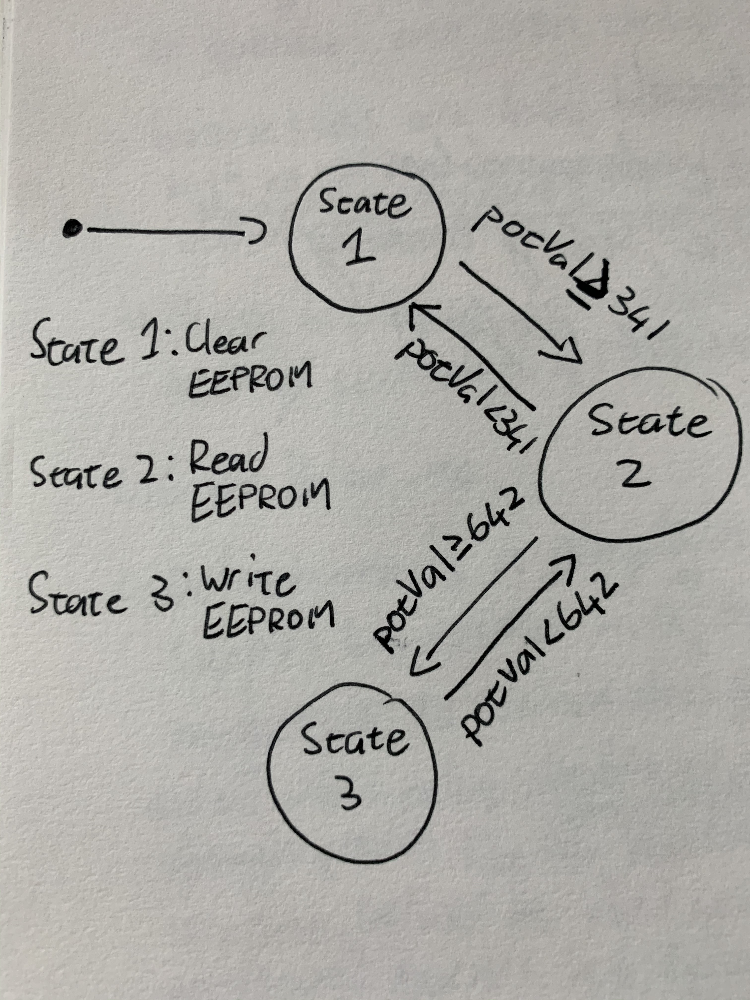

# Data Logger (and using cool sensors!)

## Part A.  Writing to the Serial Monitor
 
**a. Based on the readings from the serial monitor, what is the range of the analog values being read?**
0 to 1023.
**b. How many bits of resolution does the analog to digital converter (ADC) on the Arduino have**
7-bit resolution.

## Part C. Resistance & Voltage Varying Sensors 
One of the useful aspects of the Arduino is the multitude of analog input pins. We'll explore this more now.
 
### FSR

**a. What voltage values do you see from your force sensor?**

0 to 1000V.

**b. What kind of relationship does the voltage have as a function of the force applied? (e.g., linear?)**

Exponential (little force to actuate the sensor but substantial force to push it to the outmost range).

**c. In `Examples->Basic->Fading` the RGB LED values range from 0-255. What do you have to do so that you get the full range of output voltages from the RGB LED when using your FSR to change the LED color?**
Cycle through the FSR values mod256 as follows:
```c++
if(res_value <= 255){
    setColor(0, res_value%256, 255-res_value%256);
}
else if(res_value < 511){
    setColor(res_value%256, 255-res_value%256, 0);
}
else if(res_value < 767){
    setColor(255-res_value%256, 0, res_value%256);
}
```

## Flex Sensor, Photo cell, Softpot

**a. What resistance do you need to have in series to get a reasonable range of voltages from each sensor?**
Flex - 2 10KOhm resistors in series (20KOhms)

**b. What kind of relationship does the resistance have as a function of stimulus? (e.g., linear?)**
Flex - Linear

Control the colors of the LED using the above sensors ( including FSR )
Flex: `part_c_flex.MOV`
FSR: `part_c_fsr.MOV`

## Part D. I2C Sensors 

### Accelerometer
 
**a. Include your accelerometer read-out code in your write-up.**


## Part E. Logging values to the EEPROM and reading them back
 
### 1. Reading and writing values to the Arduino EEPROM

**a. Does it matter what actions are assigned to which state? Why?**
Yes. Assuming the labels of the states remained intact, if you swapped the functionality of the states the program
may not work as intended. For example, if you swap the actions of state 0 and state 1, you would never be able to read the data obtained in state 2 as state 1 would clear the memory.

**b. Why is the code here all in the setup() functions and not in the loop() functions?**
Honestly not sure, but best guess is that you only want the code to run once on a state transition.

**c. How many byte-sized data samples can you store on the Atmega328?**
1024 samples.

**d. How would you get analog data from the Arduino analog pins to be byte-sized? How about analog data from the I2C devices?**
Ints are smaller than bytes so you can store them straight to EEPROM memory.
**e. Alternately, how would we store the data if it were bigger than a byte? (hint: take a look at the [EEPROMPut](https://www.arduino.cc/en/Reference/EEPROMPut) example)**
Use `EEPROM.put(data)` combined with an increment of `sizeof(data)`.

### 2. Design your logger
 
**a. Turn in a copy of your final state diagram.**



## Part G. Create your own data logger!
 
**a. Record and upload a short demo video of your logger in action.**
See `media/part_g.MOV`.
