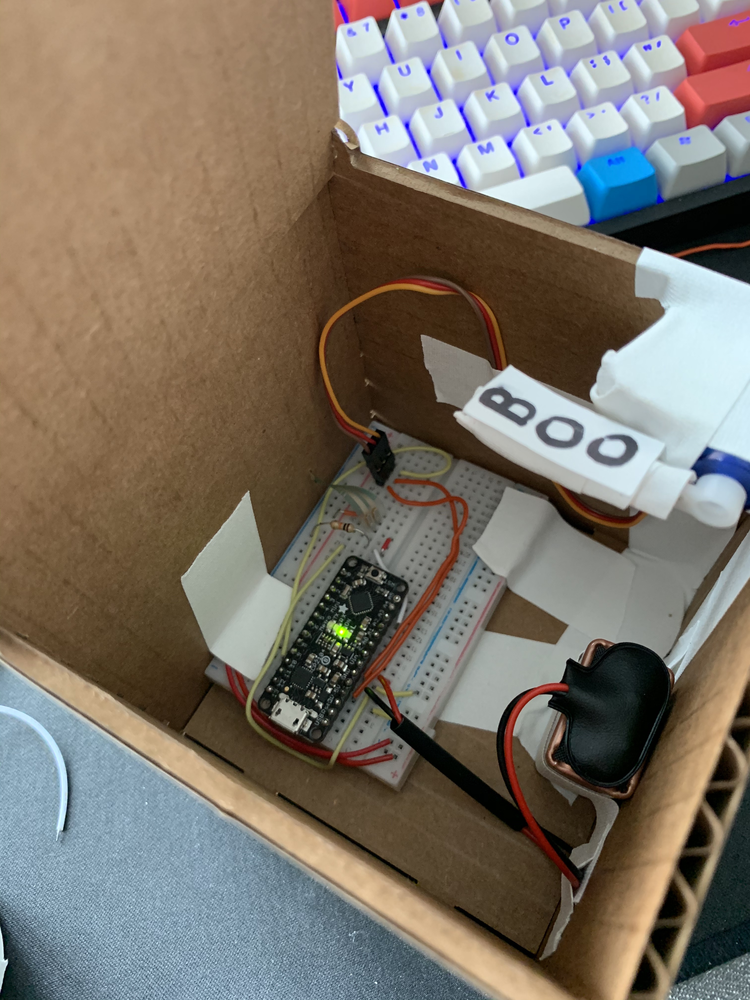

# Lab 5 -  Jack in the Box!

## Code
```c++
#include <Servo.h> 

// Pins
#define servoPin  10
#define switchPin A3

// Open and close position for servo
#define closePos  180 
#define openPos   95

// Servo and state vars
Servo servo;
int switchState;
int previousSwitchState;

void toggleSwitch(int switchState){
    // Set servo position depending on switchState
    if(switchState == HIGH){
        servo.write(openPos);
    }
    else{
        servo.write(closePos);
    }
    previousSwitchState = switchState;
}

void setup(){
    // Setup FSR
    pinMode(switchPin, INPUT);
    switchState = LOW;
    previousSwitchState = LOW;

    // Setup Servo
    servo.attach(servoPin);
    servo.write(closePos);
}

void loop(){ 
    // Read FSR, if above 100 set  switchState to HIGH, else LOW
    int fsrValue = analogRead(switchPin);
    Serial.println(fsrValue);
    if(fsrValue > 200){
        switchState = HIGH;
    }
    else{
        switchState = LOW;
    }

    // Toggle switch if state has changed
    if (switchState != previousSwitchState){
        toggleSwitch(switchState);
    }
    delay(20);
}
```
## The Jack
The Jack is very un-fancy. It was made by wrapping wires together on a servo arm and wrapping those in tape. Any piece of paper can then be stuck to the tape easily.

## The Box




## In Action!
See `media/Jack_InAction.MOV`! The Jack is triggered using the FSR at the back of the box. Applying a small amount of force will actuate the sensor and cause the Jack to pop up!
