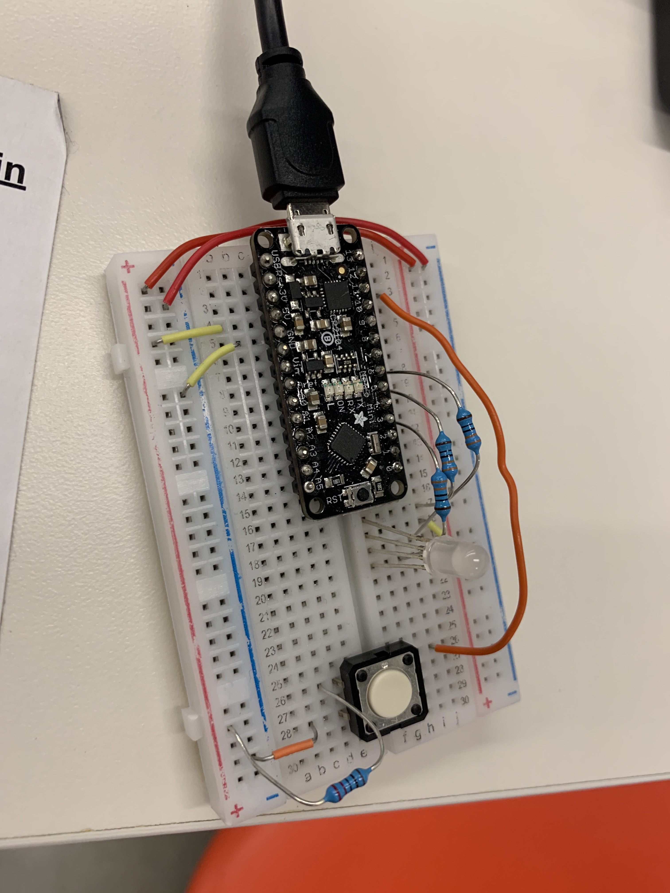
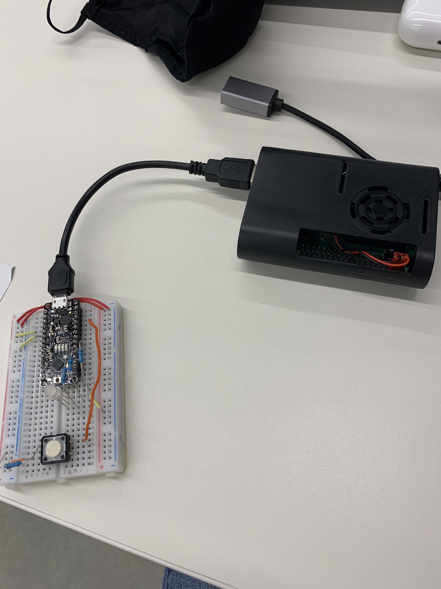

# Remote Doorbell!
**Eli Roussos**

The goal of this project was to build a remote doorbell using a Pi and Arduino, with 
a client side webpage to display who was at the door.

## Hardware Components


## Software Components
### Arduino Doorbell
The first part of the project is the Arduino attached to the Pi Server, which will change the colour of the RGB LED attached to it when a message is received through the Serial interface. It will also relay a message through the same interface to the Pi when the button is pressed, signaling the doorbell should be rang.
```c++

```
### Pi Server
The Pi server is built on top of flask, using pyserial to communicate to the Arduino on the 9600 baud line, socketio to receive messages from the client and OpenCV and imutils to stream the camera feed to the client.

First we initialise flask, parse our command line arguments and setup the serial connection with Arduino. There are 2 command line arguments, *-u* to specify the usb device and *-c* to specify the camera device.
```python
# Flask Webserver
app = Flask(__name__)
app.config['SECRET_KEY'] = 'secret!'
socketio = SocketIO(app)

# Arguments
ap = argparse.ArgumentParser()
ap.add_argument("-u", "--usb", type=str, help="usb serial of arduino", default="ttyUSB0")
ap.add_argument("-c", "--camera", type=int, help="camera device", default=0)
args = vars(ap.parse_args())
usb = args["usb"]
camera = args["camera"]

# Arduino communication
ser = serial.Serial(f'/dev/{usb}', 9600)
def read_from_port(ser):
    while True:
        reading = ser.readline().decode().strip()
        print(reading)
        socketio.emit('server-msg', reading)

thread = Thread(target=read_from_port, args=[ser])
thread.start()
```

We can initialise the video stream with our parse camera option, as well as the state variables we need. The `generate()` method will be used to transform output from the video stream in a jpeg to be constantly displayed on the webpage.
```python
# Video Stream
outputFrame = None
lock = Lock()
vs = VideoStream(src=camera).start()
time.sleep(2)

def generate():
    # grab global references to the output frame and lock variables
    global outputFrame, lock
    # loop over frames from the output stream
    while True:
        # wait until the lock is acquired
        with lock:
            # check if the output frame is available, otherwise skip
            # the iteration of the loop
            if outputFrame is None:
                continue
            # encode the frame in JPEG format
            (flag, encodedImage) = cv2.imencode(".jpg", outputFrame)
            # ensure the frame was successfully encoded
            if not flag:
                continue
        # yield the output frame in the byte format
        yield(b'--frame\r\n' b'Content-Type: image/jpeg\r\n\r\n' + bytearray(encodedImage) + b'\r\n')

```

In order to communicate with the client (and vice-versa), we will use MQTT. We setup the MQTT connection through the `mqtt.eclipse.org` broker, and communicate over the `ixe` pubsub channel. On receiving particular messages from the channel, the server will write serial to the Arduino informing it which color should be output. See `media/MQTT_Messages` for a demonstration of how this works.
```python
# MQTT client
client = mqtt.Client()
broker = "mqtt.eclipse.org"
topic = "ixe"

# Message functions
def on_connect(client, userdata, flags, rc):
    print("Connected with result code "+str(rc))
    # Subscribing in on_connect() means that if we lose the connection and
    # reconnect then subscriptions will be renewed.
    client.subscribe(topic)
def on_message(client, userdata, msg):
    receivedMessage = str(msg.payload.decode("utf-8"))
    print("received message = "+receivedMessage)
    if receivedMessage == "red":
        ser.write(b'R')
    elif receivedMessage == "blue":
        ser.write(b'B')
    elif receivedMessage == "green":
        ser.write(b'G')
    elif receivedMessage == "off":
        ser.write(b'L')

client.on_connect = on_connect
client.on_message = on_message
client.connect(broker, 1883, 60)
client.loop_start()
```

Our webapp needs routes, which we define through Flask. We have a homepage `/` route and a `/video_feed` route that the video is being streamed to.
```python
@app.route('/')
def index():
    return render_template('index.html')

@app.route("/video_feed")
def video_feed():
	# return the response generated along with the specific media
	# type (mime type)
	return Response(generate(),
		mimetype = "multipart/x-mixed-replace; boundary=frame")
        
```

We also need to be able to handle messages from the client, done through socketio. There is one for each possible LED state on the Arduino.
```python
# Handle the LED messages
@socketio.on('ledBLUE')
def led_blue():
    print("Turn the LED blue!")
    client.publish(topic, "blue")

@socketio.on('ledRED')
def led_red():
    print("Turn the LED red!")
    client.publish(topic, "red")

@socketio.on('ledGREEN')
def led_green():
    print("Turn the LED green!")
    client.publish(topic, "green")

@socketio.on('ledOFF')
def led_off():
    print("Turn the LED off!")
    client.publish(topic, "off")
```

Finally, we setup our video stream thread and define a main function to run the server.
```python
def stream_video():
    global outputFrame, vs, lock
    while True:
        frame = vs.read()
        with lock:
            outputFrame = resize(frame, width=400).copy()


def main():
    t = Thread(target=stream_video)
    t.daemon = True
    t.start()
    app.run(host='0.0.0.0', threaded=True)
    socketio.run(app)
    try:
        while True:
            time.sleep(1)
    except KeyboardInterrupt:
        ser.close()
        client.disconnect()
        client.loop_stop()
        vs.stop()
        print ("done")
```

### Client Side WebApp
The client side webapp is runs entirely in the browser through vanilla javascript and socketio, as well as a single html file.

The single file, `index.html`, defines the layout of the webpage. Four buttons are defined, each sending a different message to the server to switch on (or off) different lights. We also define 2 media sources: An `img` tag, which actually streams our video feed from `/video_feed`, and an `audio` tag, which tells us where to grab our doorbell sound from.

```html
<!doctype html>
<html>
    <head>
        <meta charset="utf8"/>
        <title>Interaction Engine - Hello You!</title>
<script src="static/socket.io.js">
<script type="text/javascript" charset="utf-8">
    var socket = io();
    socket.on('connect', function() {
        socket.emit('my event', {data: 'I\'m connected!'});
    });
</script>
<!--        <script src="/socket.io/socket.io.js"></script>-->
        <script src="static/client.js"></script>
    </head>
    <body>
        <body bgcolor="#000">
        <button onclick="ledRED()">LED RED</button>
        <button onclick="ledBLUE()">LED BLUE</button>
        <button onclick="ledGREEN()">LED GREEN</button>
        <button onclick="ledOFF()">LED OFF</button>
	<br>
	
    </body>
    <audio id="doorbell", loop="false", volume="60", duration=2>
        <source src="https://www.soundjay.com/door/doorbell-6.mp3" type="audio/mp3">
    </audio>
</html>

```

The JavaScript for the client is also simple. In it, we define a function for each of the buttons, which use socketio to relay the respective messages through MQTT to the Pi server. Socketio is also used to receive MQTT messages from the Pi server. In this case it listens for the "dark" message, which when received will play the doorbell sound defined in the DOM.

```javascript
var socket = io();

function ledRED() {
    socket.emit('ledRED');
	console.log('ledRED');

}

function ledBLUE() {
    socket.emit('ledBLUE');
	console.log('ledBLUE');
}

function ledGREEN() {
    socket.emit('ledGREEN');
	console.log('ledGREEN');
}

function ledOFF() {
    socket.emit('ledOFF');
	console.log('ledOFF');
}

// read the data from the message that the server sent and ring doorbell if correct message
socket.on('server-msg', function(msg) {
    switch(msg) {
        case 'dark':
            var doorbell = document.getElementById("doorbell");
            doorbell.loop = false;
            console.log('black');
            doorbell.play();
            break;
    }
});

```

## See it in action!
See `media/doorbell-in-action.MOV` and `media/doorbell-outside.MOV`!